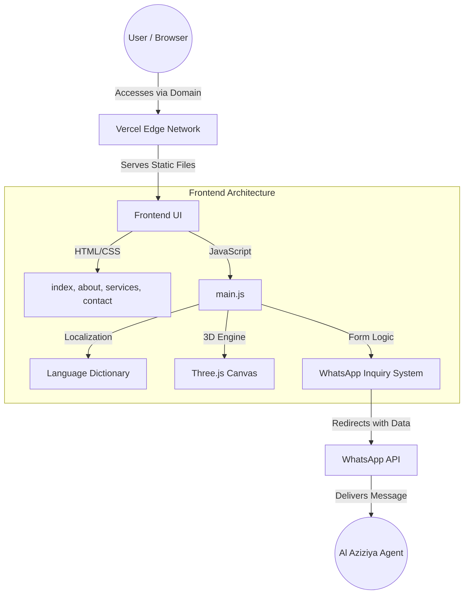

# 🌟 Al Aziziya Turizm


Al Aziziya Turizm is a premium travel agency based in Istanbul, Turkey, providing luxury travel packages, Mercedes VIP transfers, and flight bookings since 2012. 

This repository contains the source code for the official website, designed to provide a stunning, high-performance, and deeply interactive user experience.

---

## ✨ Key Features

- **🌍 Multi-language Support**: Seamless dynamic switching between English, Arabic, and Turkish.
- **✈️ 3D Interactive Background**: An immersive hero section featuring a custom 3D airplane model navigating through particles, built with **Three.js**.
- **📱 WhatsApp Integration**: Directly routes customized client inquiries (including travel dates, passenger counts, and service types) into formatted WhatsApp messages.
- **⚡ Ultra-Fast Performance**: Built purely with Vanilla HTML, CSS, and JavaScript. No bulky frameworks.
- **🔗 Clean URLs**: Configured perfectly with Vercel to serve extension-less `.html` pages.
- **🎨 Premium UI/UX**: Custom micro-animations, glassmorphism, responsive scroll-reveal effects, and smooth transitions.

---

## 🏗️ Architecture & Stack

This project is built to be extremely fast and lightweight while delivering an enterprise-level aesthetic.

### Tech Stack
- **Frontend**: Vanilla HTML5, CSS3 (Custom Variables, CSS Grid/Flexbox), JavaScript (ES6+)
- **3D Rendering**: [Three.js](https://threejs.org/)
- **Hosting & Deployment**: [Vercel](https://vercel.com/) (Serverless edge network)

### System Architecture Diagram



---

## 📂 Project Structure

```text
├── index.html           # Main landing page (Hero, Services, Destinations)
├── about.html           # Company history, licensing, and vision
├── services.html        # Detailed grid of travel and transfer services
├── destinations.html    # Showcases of Turkish cities and tours
├── admin.html           # Internal dashboard to view past inquiries/logs
├── vercel.json          # Vercel deployment configuration (Clean URLs)
└── js/
    └── main.js          # Core logic (Translations, UI interactions, Three.js, WhatsApp formatting)
```

---

## 🚀 Getting Started

### Local Development
Because the project uses pure static files, it is incredibly easy to run locally.

1. **Clone the repository:**
   ```bash
   git clone https://github.com/hamzax180/al-aziziya-turizm.git
   cd al-aziziya-turizm
   ```

2. **Run a local server:**
   You can use any local server, for example with Node.js:
   ```bash
   npx serve .
   ```
   Or with Python:
   ```bash
   python -m http.server 3000
   ```

3. **Open in Browser:**
   Navigate to `http://localhost:3000`

---

## 📞 Deployment

This application is configured for seamless deployment on **Vercel**. 
With the included `vercel.json`, it automatically handles:
- Stripping `.html` extensions from URLs.
- Routing paths correctly.
- Applying fast edge caching.

To deploy manually:
```bash
npm i -g vercel
vercel --prod
```

---

## 📄 License
This project is proprietary and intended for the exclusive use of Al Aziziya Turizm. All rights reserved.
